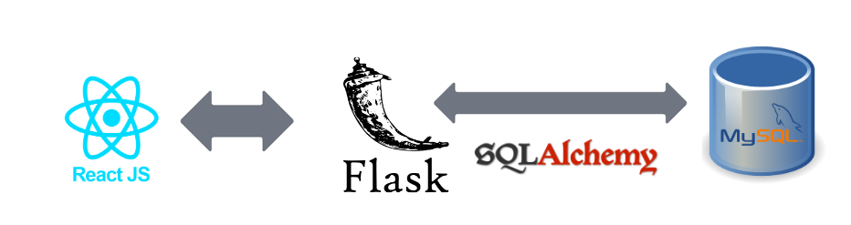

# dnd-hub

Run MySQL Workbench in the background, create schema named "dndhub_db"

`cd backend`

Install dependencies: `pip install -r requirements.txt`

Run flask server: `python3 server.py`

Prerequisites for React: ensure node.js is installed on the OS

While MySQL Workbench and flask server is still running, open up another new terminal: 

`cd frontend`

`npm start`

Browser should automatically open to http://localhost:3000/ and display React app

